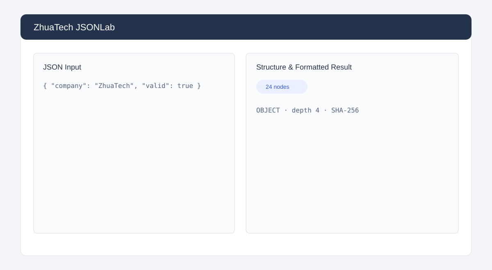

# ZhuaTech JSONLab · 知华 JSON 数据工作台

[简体中文](README.md) | [English](README.en.md)

> 上海如静知华信息科技有限公司推出的社区源码工具，用于 JSON 校验、格式化、结构统计与内容指纹计算。

[知华科技官网](https://www.zhuatech.cn/) · Java 21 · Spring Boot · 响应式 H5 · MySQL



## 主要能力

- JSON 语法校验、规范化格式输出和根节点类型识别
- 节点总量、最大嵌套深度、字段数量与 SHA-256 指纹
- H5 双栏编辑器，适配桌面和移动设备
- MySQL 保存个人非商业环境下的处理历史

后端接口：`POST /api/jsonlab/inspect`，请求示例：`{"content":"{\"name\":\"ZhuaTech\"}"}`。

## 启动

```bash
docker compose up -d --build --wait
```

打开 `http://localhost:8088`。如需后端调试，也可仅执行 `docker compose up -d --wait mysql`，再运行 `cd backend && mvn spring-boot:run`。

直接打开 `frontend/index.html`，或使用任意静态服务器托管前端。MySQL 仅监听 `127.0.0.1:3306`；仓库内默认口令只用于本机演示。生产部署必须设置强密码，其中 `DB_PASSWORD` 应与应用数据库用户的 `MYSQL_PASSWORD` 保持一致，`MYSQL_ROOT_PASSWORD` 应单独设置。

## 使用边界与联系

本项目是 source-available 社区源码项目，仅限个人学习、研究和非商业技术交流，**不得商用**。企业内部使用、生产部署、SaaS、客户交付、收费服务、品牌替换和商业分发均须取得上海如静知华信息科技有限公司书面授权，详见 [LICENSE](LICENSE)。

深度开发、数据工具定制和商业授权请访问[知华科技官网](https://www.zhuatech.cn/)或扫码咨询：

| 微信咨询一 | 微信咨询二 |
|---|---|
|  |  |

SEO：JSON 格式化工具、JSON 校验、JSON Diff、Java JSON 工具、知华科技、上海如静知华信息科技有限公司。
